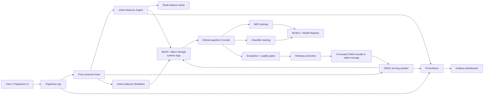

# Datanauts Intelligent Deadline Detection

Datanauts is an integrated MLOps system that adds deadline detection to
Paperless-ngx and runs the full ML lifecycle on Chameleon.

The system combines:

- a user-facing document workflow in Paperless-ngx
- an online feature service for ingest and feedback capture
- ONNX-based inference for low-latency serving
- MLflow for experiment tracking and model registry
- MinIO for artifact and runtime object storage
- automated retraining, gating, and release promotion jobs
- Grafana and Prometheus for monitoring

This README is the primary operator guide for:

- infrastructure bring-up
- Kubernetes deployment
- system architecture
- end-to-end data flow
- training and retraining behavior
- day-2 operations
- teammate responsibilities

## 1. What This Repository Deploys

At a high level, this repository brings up a Chameleon-hosted Kubernetes
deployment with these major layers:

- `paperless`: Paperless-ngx, Postgres, Redis
- `platform`: MLflow, MinIO, MLflow Postgres
- `ml`: online-features, data-generator, ONNX serving, retraining cronjobs
- `monitoring`: Prometheus, Grafana, kube-state-metrics
- `release`: staging, canary, and production inference deployments

## 2. Repository Layout

```text
components/
  common/                      Shared object-store helpers
  data/
    data_generator/            Synthetic traffic generator
    evaluation_monitoring/     Drift and data-quality jobs
    online_features/           Ingest and feedback capture service
  paperless_hooks/             Paperless post-consume integration
  platform_automation/         Retrain, evaluate, promote, release scripts
  serving/                     ONNX inference runtime
  training/                    NER and classifier training code

infra/
  terraform/openstack/         Chameleon / OpenStack provisioning
  ansible/                     k3s bootstrap and cluster deployment

k8s/
  paperless/                   Paperless application manifests
  platform/                    MLflow and MinIO manifests
  ml/                          ML services and CronJobs
  monitoring/                  Prometheus and Grafana manifests
  release/                     staged inference deployments
  sealed-secrets/              optional sealed-secret manifests

scripts/
  infra-up.sh                  full infra + k3s + stack bring-up
  bootstrap-production.sh      single-node bootstrap on an existing VM
  deploy-existing-cluster.sh   deploy repo onto an already-running cluster
  create-secrets.sh            create and mirror runtime secrets
  sync-public-endpoints.sh     inject public host/IP into runtime config
  rebuild-k3s-images.sh        build and import custom images into k3s
  demo-links.sh                print public URLs
  demo-readiness-check.sh      quick end-to-end readiness checks
```

## 3. Recommended Bring-Up Paths

There are two supported ways to bring this system up.

### Path A: Full Chameleon Infrastructure Bring-Up

Use this when you want the repository to provision the Chameleon/OpenStack
instances and then bootstrap Kubernetes on them.

This is the preferred path for a fresh environment.

### Path B: Bootstrap on an Existing VM or Existing Cluster

Use this when:

- you already have a Chameleon VM
- you already have a running k3s cluster
- you want to re-deploy the repo without reprovisioning instances

This is the faster path for iterative demo/debug work.

## 4. Path A: Full Infrastructure Bring-Up on Chameleon

### 4.1. Prerequisites

You need:

- a Chameleon project
- active Chameleon leases / reservations
- an OpenStack `openrc` file or equivalent `OS_*` credentials
- `terraform`
- `ansible-playbook`
- `ssh`

You must also know or fill in the required values in:

- `infra/terraform/openstack/terraform.tfvars`

Important expected inputs include:

- network and subnet IDs
- Chameleon image name
- SSH keypair name
- private key path
- reservation IDs / leased flavor IDs
- optional object storage container name for bootstrap artifacts

### 4.2. One-Command Infra Bring-Up

```bash
source <your-openrc-file>
cp infra/terraform/openstack/terraform.tfvars.example infra/terraform/openstack/terraform.tfvars
./scripts/infra-up.sh
```

What `scripts/infra-up.sh` does:

1. validates Terraform variables
2. runs Terraform in `infra/terraform/openstack`
3. provisions the control-plane and worker nodes
4. provisions attached durable block volumes
5. assigns floating IPs
6. generates an Ansible inventory from Terraform outputs
7. bootstraps `k3s` with Ansible
8. fetches a ready-to-use kubeconfig
9. deploys the full Kubernetes stack

### 4.3. Infra Layer Responsibilities

Terraform provisions:

- one control-plane node
- one worker node
- durable block volumes for persistent data
- network ports
- security group
- router and floating IPs
- bootstrap object-storage container name

Ansible then:

- installs `k3s`
- joins the worker node
- prepares persistent mount points
- applies Kubernetes manifests
- waits for rollouts

Relevant files:

- `infra/terraform/openstack/README.md`
- `infra/ansible/README.md`
- `scripts/infra-up.sh`

## 5. Path B: Bring Up on an Existing VM or Existing Cluster

### 5.1. Single-Node Existing VM

If you already have a VM and want this repo to bootstrap k3s and deploy the
stack directly:

```bash
bash scripts/bootstrap-production.sh <PUBLIC_IP>
```

`scripts/bootstrap-production.sh` will:

- install `k3s` if needed
- configure kubeconfig
- optionally disable host firewalls that break pod networking
- create namespaces
- create and mirror secrets
- sync the public host/IP into manifests
- build and import custom images into k3s
- apply Paperless, platform, monitoring, ML, and release manifests
- bootstrap MinIO
- optionally seed model/data artifacts

### 5.2. Existing Multi-Node k3s Cluster

If the cluster already exists and you only want to deploy the repo:

```bash
export KUBECONFIG=<path-to-kubeconfig>
export CONTROL_PLANE_PUBLIC_IP=<public-ip>
export CONTROL_PLANE_NODE_NAME=<node-name>
bash scripts/deploy-existing-cluster.sh
```

This path:

- renders manifests with the correct public IP and node name
- refreshes secrets
- applies the stack
- restarts image-based workloads
- waits for rollout completion

## 6. Secrets and Credentials

Create secrets with:

```bash
bash scripts/create-secrets.sh
```

This creates:

- `paperless-secrets` in `paperless`
- `platform-secrets` in `platform`
- `monitoring-secrets` in `monitoring`
- mirrored runtime copies in `ml`

To print credentials later:

### Paperless

```bash
kubectl get secret -n paperless paperless-secrets -o jsonpath='{.data.PAPERLESS_ADMIN_USER}' | base64 --decode && echo
kubectl get secret -n paperless paperless-secrets -o jsonpath='{.data.PAPERLESS_ADMIN_PASSWORD}' | base64 --decode && echo
```

### Grafana

```bash
kubectl get secret -n monitoring monitoring-secrets -o jsonpath='{.data.GRAFANA_ADMIN_USER}' | base64 --decode && echo
kubectl get secret -n monitoring monitoring-secrets -o jsonpath='{.data.GRAFANA_ADMIN_PASSWORD}' | base64 --decode && echo
```

### MinIO

```bash
echo mlflow
kubectl get secret -n platform platform-secrets -o jsonpath='{.data.MINIO_ROOT_PASSWORD}' | base64 --decode && echo
```

## 7. Public Endpoints

The system exposes these public URLs:

- Paperless: `http://<PUBLIC_HOST>`
- MLflow: `http://<PUBLIC_HOST>/mlflow/`
- Grafana: `http://<PUBLIC_HOST>/grafana/login`
- Prometheus: `http://<PUBLIC_HOST>/prometheus/graph`
- MinIO Console: `http://<PUBLIC_HOST>:30901`
- MinIO S3 API: `http://<PUBLIC_HOST>:30900`

To print the live links from the repo:

```bash
bash scripts/demo-links.sh
```

## 8. Architecture Overview



## 9. End-to-End Product Behavior

When a user uploads a document in Paperless:

1. Paperless OCR/parsing runs.
2. The post-consume hook reads the OCR text.
3. The hook sends the text to `online-features /ingest`.
4. The hook sends the text to ONNX inference at `/predict`.
5. ONNX serving returns predicted deadline events and confidence.
6. The hook writes prediction artifacts under Paperless storage.
7. The hook updates the Paperless document with ML-generated tags.
8. If the prediction is uncertain, the hook adds `Status:Review Needed`.
9. User review actions such as `Action:Accept` and `Action:Reject` become
   signals for monitoring and retraining.

Expected Paperless tags include:

- `Type:Deadline`
- `Deadline:YYYY-MM-DD`
- `Status:Review Needed`
- `Action:Accept`
- `Action:Reject`

## 10. Data Flow

### 10.1. Online Ingest Flow

`components/data/online_features/feature_service.py`

The online-features service:

- accepts OCR text through `/ingest`
- splits the document into sentences
- finds candidate sentences with date-like patterns
- stores extracted features in Redis
- appends runtime ingest logs
- mirrors ingest payloads to object storage

The main online runtime log prefix is:

- `runtime/online-features/ingest`

### 10.2. Feedback Flow

Feedback comes from two places:

- Paperless review interactions
- serving-side feedback endpoints

The repository stores runtime feedback under:

- `runtime/online-features/feedback`
- `runtime/serving/feedback`

These logs are the shared input to retraining.

### 10.3. Artifact and State Persistence

Persistent system state is split across:

- MinIO object storage
- MLflow Postgres metadata
- Kubernetes PVC-backed services for Paperless, MLflow DB, and monitoring

Important object-storage content includes:

- runtime ingest logs
- runtime feedback logs
- retrain decisions
- promotion decisions
- release bundles
- model artifacts logged through MLflow

## 11. Training and Retraining

### 11.1. Model Types

This system uses two learned components:

- NER model for extracting deadline-related spans
- classifier model for predicting the event type

The training code lives in:

- `components/training/src/train_ner.py`
- `components/training/src/train_classifier.py`

### 11.2. Tracking

Training runs are tracked in MLflow experiments:

- `deadline-detection-ner`
- `deadline-detection-classifier`
- `deadline-detection-e2e`
- `deadline-detection-cross-domain`

Registered models are kept under stable names:

- `deadline-ner`
- `deadline-classifier`

### 11.3. Retraining Trigger

Retraining is run by the `retrain-pipeline` CronJob in `k8s/ml/`.

The retrain loop checks:

- new feedback volume
- correction rate
- Paperless tag counts for `Action:Accept` and `Action:Reject`

The main orchestration is in:

- `components/platform_automation/run_retrain_cycle.py`

### 11.4. Retraining Data Preparation

Retraining does not just reuse a static dataset. It compiles additions from live
feedback.

`components/platform_automation/feedback_curation.py`:

- loads online feedback records
- loads serving feedback records
- loads ingest records
- filters for retraining-usable events
- writes classifier and NER training additions

### 11.5. Candidate Selection

Retraining can evaluate multiple configured model pairs.

The live path currently uses configured candidate pairs instead of live Ray Tune
sweeps.

For each candidate pair, the pipeline:

1. trains NER
2. trains classifier
3. exports ONNX
4. quantizes ONNX
5. evaluates the pair
6. applies quality gates
7. registers eligible winners in MLflow
8. packages a serving bundle for promotion

### 11.6. Release Promotion

Serving does not pull the “latest MLflow run” automatically.

Instead:

- retraining produces a bundle
- promotion jobs decide whether it is acceptable
- release automation updates the serving deployment to point to the promoted
  bundle in object storage

Main files:

- `components/platform_automation/evaluate_and_promote.py`
- `components/platform_automation/promote_release.py`
- `components/serving/app_onnx_quant.py`

## 12. Serving Behavior

The main inference runtime is ONNX-based for lower-latency serving.

The serving layer includes:

- base inference deployment
- staging deployment
- canary deployment
- production deployment

The serving runtime:

- loads the current promoted ONNX bundle
- exposes `/predict`
- emits latency, confidence, and uncertainty metrics
- can log feedback for retraining

## 13. Monitoring and Dashboards

Prometheus scrapes:

- Paperless-related services
- online-features
- ONNX serving
- cluster health
- deployment health

Grafana dashboards live in:

- `k8s/monitoring/grafana-dashboards-configmap.yaml`

Important dashboards include:

- Datanauts Overview
- Datanauts Serving
- Datanauts Data & Feedback
- Datanauts Platform Health
- Datanauts Training & Retraining

Use Grafana for:

- p95 latency
- confidence trends
- review-needed rate
- accept/reject counts
- data-quality gauge snapshots
- infrastructure health

## 14. Day-2 Operations

### 14.1. Health checks

```bash
export KUBECONFIG=~/.kube/config
bash scripts/chameleon-health-check.sh
```

### 14.2. Pod status

```bash
kubectl get pods -n paperless
kubectl get pods -n platform
kubectl get pods -n monitoring
kubectl get pods -n ml
```

### 14.3. Logs

```bash
kubectl logs -n paperless deploy/paperless-ngx --tail=150
kubectl logs -n ml deploy/online-features --tail=150
kubectl logs -n ml deploy/deadline-onnx-serving --tail=150
```

### 14.4. Trigger jobs manually

```bash
kubectl create job --from=cronjob/retrain-pipeline retrain-manual -n ml
kubectl create job --from=cronjob/model-promotion-gate model-promotion-manual -n ml
kubectl create job --from=cronjob/release-promotion release-promotion-manual -n ml
```

### 14.5. Check latest matching job logs

```bash
./scripts/latest-job-log.sh ml retrain 120
./scripts/latest-job-log.sh ml data-quality 60
./scripts/latest-job-log.sh ml drift-monitor 60
```

## 15. Teammate Responsibilities

### Data

Primary areas:

- `components/data/online_features/`
- `components/data/evaluation_monitoring/`

Responsible for:

- runtime ingest capture
- feedback capture
- data-quality checks
- drift monitoring
- training-data curation inputs

Questions the data owner should be able to answer:

- what data enters the system?
- where is it stored?
- how is live data turned into retraining data?
- how do we detect drift or low-quality samples?

### Training

Primary areas:

- `components/training/`
- `components/platform_automation/run_retrain_cycle.py`
- `components/platform_automation/feedback_curation.py`

Responsible for:

- model training code
- candidate definitions
- evaluation logic
- quality gates
- MLflow tracking and registration

Questions the training owner should be able to answer:

- where does retraining data come from?
- where are model artifacts stored?
- how are candidates selected?
- how do quality gates work?

### Serving

Primary areas:

- `components/serving/`
- `k8s/release/`

Responsible for:

- inference behavior
- latency and confidence monitoring
- promoted model bundle loading
- staged deployment behavior

Questions the serving owner should be able to answer:

- how does serving pick the model?
- what bundle is currently in production?
- what happens under uncertainty?
- what latency/confidence do users see?

### DevOps / Platform

Primary areas:

- `infra/`
- `k8s/`
- `scripts/`
- `k8s/monitoring/`

Responsible for:

- instance provisioning
- cluster bootstrap
- secrets
- durable storage
- stack deployment
- monitoring and rollout health

Questions the DevOps owner should be able to answer:

- how is the cluster brought up?
- which manifests deploy which services?
- where is persistence provided?
- how are public endpoints wired?

## 16. Demo Checklist

Before a demo:

1. run `bash scripts/demo-readiness-check.sh`
2. run `bash scripts/demo-links.sh`
3. confirm Paperless login works
4. confirm MLflow loads
5. confirm Grafana loads
6. confirm MinIO console loads
7. upload one known-good document
8. verify generated tags in Paperless
9. verify Grafana panels move
10. verify MLflow shows recent runs

## 17. Quick Troubleshooting

### Dashboard says “not found”

- refresh the page
- log in again to Grafana
- verify the dashboard exists in the ConfigMap

### Serving does not update

- check the promoted bundle key
- verify ONNX serving rollout status
- inspect `deadline-onnx-serving` logs

### Retraining does not trigger

- inspect `retrain-pipeline` CronJob and latest job logs
- verify feedback logs exist
- verify `Action:Accept` / `Action:Reject` counts if used as trigger signals

### Pod evictions / disk pressure

- check root disk and attached volumes
- prune stale images if necessary
- verify stateful workloads are on durable storage

## 18. Source of Truth

Use `main` as the source-of-truth branch for the integrated system unless your
team intentionally creates a review branch for ongoing work.

For a fresh deployment:

1. clone `main`
2. choose Path A or Path B
3. create secrets
4. deploy the stack
5. verify public URLs
6. verify Paperless, MLflow, Grafana, and MinIO
